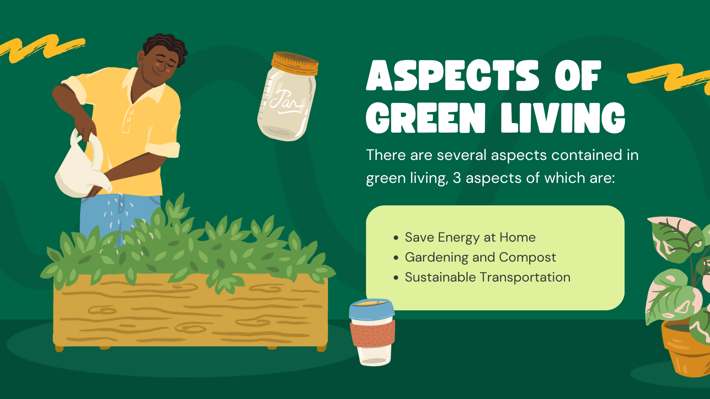

# GreenThumb - Empowering Urban Gardening and Sustainable Living

## Description

GreenThumb is an API-based platform designed to promote urban gardening, sustainable living, and community-driven food production. It serves as a hub for individuals, communities, and organizations to collaborate, share knowledge, and access resources related to urban gardening and sustainable living practices.

## Core Features

1. **Community Gardens**: Discover and join local gardening initiatives with detailed information about locations, available plots, and growing conditions.
2. **Crop Planning and Tracking**: Plan, track, and optimize gardening activities, including crop rotations, planting schedules, and harvest records.
3. **Knowledge Sharing**: Access a curated library of gardening guides, tutorials, and best practices contributed by experienced gardeners and organizations.
4. **Soil and Pest Management Resources**: Access authoritative sources for soil analysis data, pest identification, and organic pest control methods.
5. **Resource Exchange**: Exchange or share gardening resources such as tools, seeds, compost, and surplus produce within the community.
6. **Volunteer Coordination**: Coordinate volunteers for community garden maintenance, events, and educational workshops.
7. **Local Partnership Integration**: Integrate with local nurseries, farms, and organizations to promote their products, services, and events.

## External API Integration
- **Weather and Climate Data**: Provide accurate local climate data for informed gardening decisions.

## Technologies Used

- **Java**: Core programming language for backend development.
- **Spring Boot**: Framework for building robust and scalable APIs.
- **MySQL**: Relational database management system for data storage.
- **Swagger**: API documentation tool for clear and comprehensive documentation.
- **JWT**: For secure authentication and authorization.
- **Lombok**: Annotation-based library for reducing boilerplate code.

## Dependencies

### Spring Boot
- **spring-boot-starter-data-jpa**: Used for data access and persistence.
- **spring-boot-starter-web**: Provides essential web-related features.
- **spring-boot-devtools**: Tools for improving the development experience.
- **spring-boot-starter-test**: Dependencies for testing Spring Boot applications.
- **spring-boot-starter-oauth2-resource-server**: Adds OAuth2 support for resource servers.
- **spring-boot-starter-actuator**: Adds production-ready features to Spring Boot applications.

### Database
- **mysql-connector-java**: JDBC driver for connecting Java applications to MySQL databases.

### JSON Web Tokens (JWT)
- **jjwt-api**: Library for working with JSON Web Tokens.

### Maven Plugins
- **maven-compiler-plugin**: Maven compiler plugin for compiling Java code.
- **spring-boot-maven-plugin**: Maven plugin for building and running Spring Boot applications.

### Flyway
- **flyway-core**: Database migration tool for managing changes to the database schema.
- **flyway-mysql**: Flyway plugin for MySQL.

### Mapping Tools
- **mapstruct**: Code generation tool for simplifying mappings between Java bean types.

### Lombok
- **lombok**: Library for reducing boilerplate code in Java applications.

### Swagger
- **springdoc-openapi-starter-webmvc-ui**: Integrates with Spring Boot to generate OpenAPI documentation for RESTful APIs.

## Installation

1. Clone the repository: git clone https://github.com/Ibrahim-Asad/GreenThumb-RESTful-API.git
2. Navigate to the project directory.
3. Build and run the application.
4. Access the API documentation at [http://localhost:8080/swagger-ui.html](http://localhost:8080/swagger-ui.html).

## License

This project is licensed under the [MIT License](LICENSE).

## Contact

For any inquiries or feedback, please contact:
- [i.a.s.assad33@gmail.com](mailto:i.a.s.assad33@gmail.com)
- [alahamadneh35@gmail.com](mailto:alahamadneh35@gmail.com)
- [Khaled.sholi2@gmail.com](mailto:Khaled.sholi2@gmail.com)
